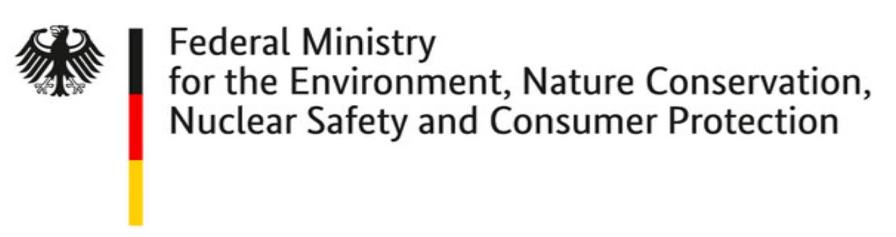

# MultimodalAD

This is a fork of the official repository to the paper 
[**"The voraus-AD Dataset for Anomaly Detection in Robot Applications"**](https://arxiv.org/pdf/2311.04765.pdf) 
by Jan Thieß Brockmann, Marco Rudolph, Bodo Rosenhahn, and Bastian Wandt
which is accepted to IEEE Transactions on Robotics and officially maintained 
at [vorausrobotik/voraus-ad-dataset](https://github.com/vorausrobotik/voraus-ad-dataset).

This Add-On repository adds experiments that show how AutoML can be used to
find better hyperparameters for the model and is a role model for how to
easily adapt this work in your own environment without doing handcrafted 
hyperparameter optimization. 

If you have questions or want to contribute, please refer to the official 
repository. 

---
Paper abstract:
>During the operation of industrial robots, unusual
events may endanger the safety of humans and the quality of
production. When collecting data to detect such cases, it is not
ensured that data from all potentially occurring errors is included as  
> unforeseeable events may happen over time. Therefore,
anomaly detection (AD) delivers a practical solution, using only
normal data to learn to detect unusual events. We introduce
a dataset that allows training and benchmarking of anomaly
detection methods for robotic applications based on machine
data which will be made publicly available to the research
community. As a typical robot task the dataset includes a pick-and-place 
> application which involves movement, actions of the
end effector and interactions with the objects of the environment.
Since several of the contained anomalies are not task-specific
but general, evaluations on our dataset are transferable to other
robotics applications as well. Additionally, we present MVT-
Flow (multivariate time-series flow) as a new baseline method
for anomaly detection: It relies on deep-learning-based density
estimation with normalizing flows, tailored to the data domain
by taking its structure into account for the architecture. Our
evaluation shows that MVT-Flow outperforms baselines from
previous work by a large margin of 6.2% in area under ROC.

We introduce the **voraus-AD dataset**, a novel dataset for **anomaly detection** in robotic applications as well as an unsupervised method **MVT-Flow** which finds anomalies on **time series of robotic machine data** without having some of them in the training set.

[**Download the Dataset 100 Hz** ](https://media.vorausrobotik.com/voraus-ad-dataset-100hz.parquet)    
(~1,1 GB Disk / ~2.5 GB RAM) - used in this repository

[**Download the Dataset 500 Hz**](https://media.vorausrobotik.com/voraus-ad-dataset-500hz.parquet)    
(~5.3 GB Disk / ~12.5 GB RAM)

**Please note:** The datasets in both the 100 Hz and 500 Hz variants are licensed under the [Creative Commons Attribution-NonCommercial-ShareAlike 4.0 International License](https://creativecommons.org/licenses/by-nc-sa/4.0/) (CC BY-NC-SA 4.0).

---

## Getting Started

You will need [Python 3.9](https://www.python.org/downloads/) and the packages specified in requirements.txt. We recommend setting up a [virtual environment with pip](https://packaging.python.org/guides/installing-using-pip-and-virtual-environments/) and installing the packages there.

Install packages with:

```shell
python3.9 -m venv venv
source venv/bin/activate
pip install --upgrade pip
pip install -r requirements.txt
```

If you want to run the AutoML code, please install SMAC with:

```shell
pip install smac
```

Note: The installation of SMAC can raise an incompatible dependency 
warning or error. This should not be a problem!


## Configure and Run

Set the variable `DATASET_PATH` in [train.py](train.py) to the path of the downloaded dataset file.
The variable `configuration` contains the training configuration as well as the hyperparameters of the model. The paper describes all the configuration parameters in detail. Make also sure to execute the tests before training. The test `test_train` may take a few minutes depending on your setup.

```shell
pytest
```

The [train.py](train.py) is entrypoint to this repository, it contains the configuration, training and validation steps for our model. The default configuration will run a training with **paper-given parameters** on the provided voraus-AD dataset (@100 Hz).
To start the training, just run [train.py](train.py)! 

```shell
python train.py
```

If training on the voraus-AD data does not lead to an AUROC greater 0.9, something seems to be wrong. Don't be worried if the loss is negative. The loss reflects the negative log likelihood which may be negative.
Please report us if you have issues when using the code.

---

## AutoML using SMAC
The published paper shows how to apply Normalizing Flows to multimodal data and 
proves its performance using handcrafted hyperparameter. Since 
this work is applied to a laborious crafted and high quality dataset, we 
also want to show how the method can be applied in real world scenarios in 
which may the
cost of large data collection is too high or the variance of the data is not as 
good as in the voraus-AD dataset. To simulate these situations, we subsample 
from the dataset and train the model on the subsampled data. We show how 
the performance of the model decreases with less data and how
AutoML can be used to find better hyperparameter for the model even on small
data. This shows how AutoML can be applied to reduce the cost of data 
collection. We use the SMAC framework to optimize the hyperparameter. 

The following table shows the results of the optimization with default and
SMAC hyperparameters. The results are given as mean and standard deviation of
the mean AUROC on the test set. The results are calculated using 5 runs:


<div align="center">

| Train Data | Handcrafted Optimization | AutoML Optimization |
|:----------:|:------------------------:|:-------------------:|
|    100%    |    93.40% (+/- 0.51%)    | 93.52% (+/- 1.55%)  |
|    75%     |    91.8%% (+/- 0.30%)    | 92.68% (+/- 2.72%)  |
|    50%     |    88.90% (+/- 1.43%)    | 92.17% (+/- 0.51%)  |
|    25%     |    75.50% (+/- 2.45%)    | 90.84% (+/- 0.72%)  |
|    10%     |    47.52% (+/- 1.13%)    |  85.13% (+/-1.30%)  |

</div>

The code to reproduce the optimization with SMAC is given in the
`train_smac.py` script. Settings can be found in the source code.

---

## Citation

Please cite the paper in your publications if it helps your research.

    @article { BroRud2023,
      author = {Jan Thie{\"s} Brockmann and Marco Rudolph and Bodo Rosenhahn and Bastian Wandt},
      title = {The voraus-AD Dataset for Anomaly Detection in Robot Applications},
      journal = {Transactions on Robotics},
      year = {2023},
      month = nov
    }


## License Notice

The **content of this repository** is licensed under the [MIT License](https://opensource.org/license/mit/).   
The **datasets** are licensed under the [CC BY-NC-SA 4.0 License](https://creativecommons.org/licenses/by-nc-sa/4.0/). 


## Credits and Acknowledgements

Some code of the [FrEIA framework](https://github.com/VLL-HD/FrEIA) was used for the implementation of Normalizing Flows. Follow [their tutorial](https://github.com/VLL-HD/FrEIA) if you need more documentation about it.

The contribution of the Leibniz University Hannover was supported by the 
Federal Ministry of the Environment, Nature Conservation, Nuclear Safety and 
Consumer Protection, Germany under the project 
**GreenAutoML4FAS** (grant no. 67KI32007A). 

<p align="center">
     
    
     
</p>

